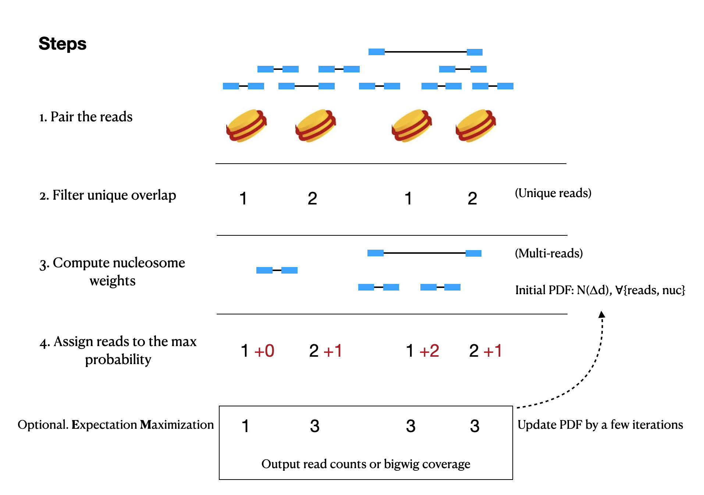

# Nucount
A nucleosomal reads counting tool


## About
`Nucount` is a R tool for estimating ChIP-seq reads with nucleosome positions. Adjacent reads will be assigned by Estimation Maximization approach. 




## Example

You can test `Nucount` with [examples](https://github.com/shaorray/Nucount/example).

```
#!/bin/bash -l
Rscript Nucount_script.R \
-b 'example/bam/H3K4me3_GSM2417080_Chronis_example.bam' \
 -p FALSE \
 -n 'example/nuc_fltd_gr_mm9_20.RData' \
 -t 'example/tss_mm9_gr.RData' \
 --is_EM TRUE --iter_num 2 \
 -o 'H3K4me3_test' --type 'bw' \
 --quietly FALSE

```


